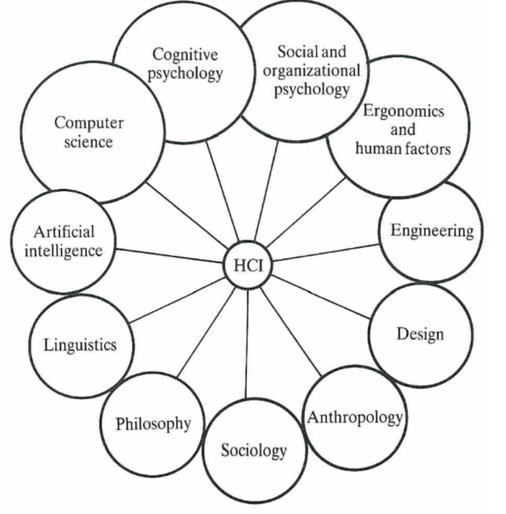

# Introduction
## August 31, 2016

---
# Outline for today

 1. **Introductions**

 2. Overview of course

 3. Introduction to HCI

 4. GitHub exercise

 5. Housekeeping

 6. Next week

---
# Introductions #

 - Go-around
  - Tell us about yourself
  - What program are you in?
  - What's your academic/work background?
  - What do you hope to get out of this program?
  - Is there anything particular you'd like to get out of this course?

---
# Outline for today #

1. Introductions

2. **Overview of course**

3. Introduction to HCI

4. GitHub exercise

5. Housekeeping

6. Next week

---
.left-column[
### Overview of course
]
.right-column[

- My philosophy

- 15 weeks; Last day 7 December with 14 December as a make-up

- This course heavy on reading and **thinking** with a final project for applied creativity

- Many small assignments - continuous workload; no cramming at the end

- I'll try to follow-up on the blog and twitter; please feel free to share interesting things you find or learn with all of us!

]

???

- This is one of most "academic" courses in the program focused more on
 thinking and analyzing versus doing

- But my goal is to help you in your career aspirations.

  - This means using tools
 like GitHub so you have a portfolio of activity in front-end design.

  - You should come away with methodologies and references, in addition to
  notes and knowledge.

- I want all of you to perform very well
    - weeklies - The goal is for you to draw on principles you found important
    in your learning and capture that in notes. Then spend time thinking about
    how you understand this point experientially. This is about understanding
    principles - not details knowledge that you will just forget later.

- Rubrics are designed to make it easy for you to know if you've met the
    mark.

- Collaboration is important, but you should be judged on your own work and
  not those of your classmates in group assignments.

---
  .left-column[
  ### Overview of course(2)
  ]
  .right-column[

- Objectives & Assignment
- Informal Objectives
- Skills Exercised
  - Critical Thinking and Analysis
  - Writing
  - Technical Presentation
  - Synthesis
- Texts for this class
 - Persuasion... why build to this?
  ]

???

- I don't expect you to know how to read scientific papers from the start;
this is one of our objectives. You will learn to summarize research papers
in this way:
  - Research question
  - Hypotheses
  - Variables
  - Research Design
  - Data collection/protocol
  - Analysis
  - Results/findings
- Other considerations in critiques:
  - Does the paper seem important or not? Does it make a contribution?
  - Is the methodology sound or suspect?
  - Does this paper get its message across clearly?
  - Does it change your thoughts or has it introduced new ideas to you?

- My informal objectives:
  - Provide reading that is both interesting and accessible
  - Introducing you to HCI conference venues
  - Give you the tools to argue for design decisions based on cognitive needs
  - Perform well in interviews when asked about formal training

- I hope that by the end of this class you feel comfortable with the following:
  - Reading scientific papers
  - Attending / Participating in an HCI conference
  - Designing a simple experiment; perhaps, for your thesis

- Texts
  - Ware - the relation between seeing and cognition. Basic principles that are
  fundamental to cognition, in general.
  - Kahneman - nobel prize winner in heuristics and biases in human decision
  making. Founded a revolution in 'behavioral economics', despite not being
  an economist, but a cognitive psychologist.
    - Prospect theory - people analyze choices in terms of losses and gains
    instead of final outcome.
    - Heuristics and Biases - people use mental shortcuts in decision-making,
    often focusing on one aspect of a problem over others.
  - Johnson - decomposes well-known design guidelines to psychological bases.
  Covers most of the topics in the class, though we will build on knowledge
  in this class, not starting from design principles, but the other direction
  - how the brain works.

- Persuasion
  - I'll give you a brief preview of persuasion and why we end with this as a
  capstone rather than have you all work on projects focused on some particular
  cognitive community (e.g, sight-impaired, second-language learners, etc.)
  - Persuasion concerns influencing user behavior; it builds on all of the
  knowledge you gain in this course from perceptual patterns (or frames) to
  decision-making in context.

---

# Outline for today #

1. Introductions

2. Overview of course

3. **Introduction to HCI**

4. GitHub exercise

5. Housekeeping

6. Next week

---
.left-column[
### What is this class about?
]
.right-column[

- One answer (HCI)

- HCI research methods

- Slightly more refined answer

- Toward your final project: A brief introduction to persuasion

]

---
# Human Computer Interaction

- **The study of interaction between people and technology**
 - Dialogue interactions via a user interface
 - Theory is drawn from what we know about how humans interact
 - One goal of HCI, as a research discipline, is to achieve "naturalistic"
 interaction with computers. (e.g, [Star Trek](https://www.youtube.com/watch?v=MA1hD3XRlh0))
- Multi-disciplinary research field
- Research correlate of "interaction design"
- Mature, well-defined methodology and scientific practice

???

Another way of thinking of "naturalistic" is the idea of minimizing
the distance between the user's mental model of a task and the
computer's representation and support of that task.

Practitioners (interaction designers) are concerned with practical
problems in the world.

Researchers are interested in new design methodologies, experimentation
to identify fundamental principles, and developing models that capture
concepts and relations.

---
# HCI is a Multi-Disciplinary Field

.center[

Preece (2002)
]

???

Term popularized in the 80' by Stuart Card, Thomas Moran, and Allen Newell
in "The Psychology of Human-Computer Interaction".

# Preece, J., Rogers, Y. & Sharp, H. (2002).	Interaction Design: Beyond Human-computer Interaction. J. Wiley & Sons.
---

# Research Methods

Primary methodologies include:

- Observational (e.g, ethnographic research)
- Survey
- Controlled experimentation

We will look at each, but focus on hypothesis testing.
- Measure alternative designs in a very precise way.
- Much foundational work has been conducted using experimental methods.

???

And we need to understand scientific methods in order to read much of the
foundational literature of HCI and applied (interaction) design.

---
# What is this class about?

- The study of interaction between people and technology.
- We will explore basic cognitive processes that you can use as levers to align user perceptions.

.center[![../https://github.com/ub-idia640-2016/course-materials-and-discussion.githttps://github.com/ub-idia640-2016/course-materials-and-discussion.githttps://github.com/ub-idia640-2016/course-materials-and-discussion.githttps://github.com/ub-idia640-2016/course-materials-and-discussion.githttps://github.com/ub-idia640-2016/course-materials-and-discussion.githttps://github.com/ub-idia640-2016/course-materials-and-discussion.githttps://github.com/ub-idia640-2016/course-materials-and-discussion.githttps://github.com/ub-idia640-2016/course-materials-and-discussion.githttps://github.com/ub-idia640-2016/course-materials-and-discussion.githttps://github.com/ub-idia640-2016/course-materials-and-discussion.githttps://github.com/ub-idia640-2016/course-materials-and-discussion.githttps://github.com/ub-idia640-2016/course-materials-and-discussion.githttps://github.com/ub-idia640-2016/course-materials-and-discussion.githttps://github.com/ub-idia640-2016/course-materials-and-discussion.githttps://github.com/ub-idia640-2016/course-materials-and-discussion.githttps://github.com/ub-idia640-2016/course-materials-and-discussion.githttps://github.com/ub-idia640-2016/course-materials-and-discussion.githttps://github.com/ub-idia640-2016/course-materials-and-discussion.gitimages/persuasion-model1.png](../images/persuasion-model1.png)]

???

Our framework is a model of joint action.

---
# Toward your final project: persuasion

What's the difference between these three things?

- Coercion
- Manipulation
- Persuasion

???

Force/no force
Witting / not witting

---
# Persuasion

- "Influence"
- Belief, Attitude, Intention, Behavior
- Often studied in the context of politics and advertising

Persuasive? Manipulative? Why?

- [Febreze](https://www.youtube.com/watch?v=nlT8VcWz3LY)
- [Jiffy](https://www.youtube.com/watch?v=IBbzNp25OHo)
- [Nudging in NY lunchroom cafeterias](http://nudges.org/2010/06/09/nudging-in-new-york-lunchroom-cafeterias/)
- [Marketing nudge](http://nudges.org/2011/09/21/a-devious-little-marketing-nudge/)

???

- Jif
  - Choosy moms choose jif.
  - Implication: If you don't choose Jif, you are not a good mother.
- Febreze (odor remover)
  - Implication: Febreze works instead of washing

  P&G story.
http://www.nytimes.com/2012/02/19/magazine/shopping-habits.html?_r=0
  Febreze ads were doing poorly by telling people that Febreze would eliminate
  troublesome odors (e.g., pet smells, smoke on clothes). Wasn't working.
  P&G scientists studied this problem. Tied it to the routine of housecleaning --
  specifically, a routine to finish tidying by spraying Febreze.
  Added a distinct smell.

Thaler's blog highlights mechanism for "choice architecture" as:
- The tools highlighted are:
  - defaults
  - expecting error
  - understanding mappings
  - giving feedback
  - structuring complex choices
  - creating incentives

---
# Outline for today

1. **Introductions**

2. Overview of course

3. Introduction to HCI

4. **GitHub exercise**

5. Housekeeping

6. Next week

---

# GitHub Exercise #

[GitHub Basics](https://github.com/ub-idia640-2016/course-materials/blob/master/github-basics.md)

---
# Outline for today #

1. Introductions

2. Overview of course

3. Introduction to HCI

4. GitHub exercise

5. **Housekeeping**

6. Next week

---
# Housekeeping #

- Classroom v. GotoMeeting?
- Syllabus/material updates
- Concerns or questions?

---
# Outline for today #

1. **Introductions**

2. Overview of course

3. Introduction to HCI

4. GitHub exercise

5. Housekeeping

6. **Next week**

---
# Next Week #

- Research Methods Handout
- Problem Statement

???

Some examples:
- commerce
- education
- weight loss
- smoking
- community activism
