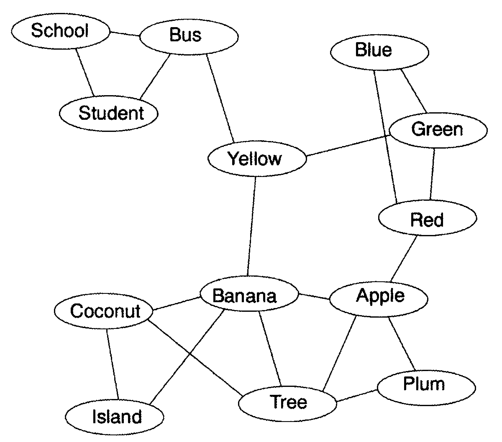
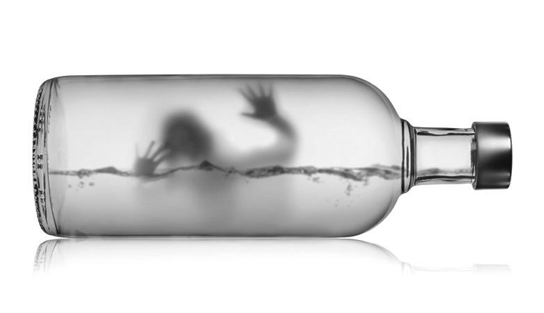

## How do we know about things?
### 26 Sept 2017

---

## Outline

1. Review (Inhibition & Biased Competition)
2. How does memory work?
3. What is priming?
4. Schemas & Frames
5. What affects learning?
6. Driving attention
7. Multimodal Communication
8. Summary of important concepts

---

## Review: Lateral inhibition

<iframe width="560" height="315" src="https://www.youtube.com/embed/sItlLNhhiLg" frameborder="0" allowfullscreen></iframe>

Capacity of an excited neuron to reduce the activity of its neighbors.

Note:

Creates contrast and occurs not only in vision system, but also other sensory systems.

Lateral inhibition disables the spreading of action potentials.

---

## Review: Behavior biasing in visual search

Note:

- Visual system has a limited ability to process information about multiple objects simultaneously.
- Compete for neural representation
- Mutually suppressive (increased neural workload)
- Attention prioritizes task relevant objects thus biasing the process.

---

## How does memory work?

Note:

---

## Working memory

*"a temporary storage system under attentional control that underpins our capacity for complex thought"* (Baddeley,2007, p.1)

Memory capacity is not limited by items, but by chunks. George Miller, 1956

Note:

.1 seconds - a couple second. Support ongoing cognitive work. Temporary grouping where connections are formed between the visual and non-visual. The most important non-visual links are help in WM.

Visual chunks bind to non-visual. Image mind to phrases. They also bind to action plans to execute a function.

Memory is networked and activated by a small amount of information through visual system to visual working memory. We don't always notice small changes.

Picture superiority effect.

Stroop effect - interference across channels.

Multi component model:

Phonological loop
- holding acoustic or speech-based sequences
- articulatory rehearsal mechanism (e.g. remember license plate)
- left hemisphere
- possibly, important for chunking (breaking up verbal information into coherent phrases). - modality effect here.
- conversion from visual to verbal
- memory effects: rhyming causes confusion, and word length has an effect on recall.

Visua-Spatial sketch pad - similar function for visual or spatially encoded items.
- right hemisphere
- separate what versus where mechanisms
- possibly, a third sub-system for action sequences

Central executive - attentionally limited system that selects and manipulates patterns / objects in the subsystems.
- planning, problem solving
- shifting & switching attention (when plan not working)
- fluency - ability to quickly and efficiently search for and generate new info
- inhibition - stop doing irrelevant actions
- keep goals in mind
- self-monitoring - check on progress

Episodic memory is a sub-system that:
- links LT memory
- integrates information from other sub-systems into a unified experience
- small area of storage capacity that does not depend on perceptual input.
- limit on "chunks of information" that can be bound together coherently
- Gives us the experience of current consciousness
- back up store to PSTM and VSSTM.
---

## Chunking

Note:

Process by which individual pieces are bound together and stored as a coherent group.

- 2-6
- modality effect
- recall effect
- language and culture effect
- familiarity effect

---

## What HM taught us

<iframe width="560" height="315" src="https://www.youtube.com/embed/Vwigmktix2Y" frameborder="0" allowfullscreen></iframe>

[H.M.](https://www.youtube.com/watch?v=Y0Od5DrdPA4)

Note:

95% of what we consciously perceive is already in our heads as long-term memory. It is also our identity. It is reconstructed - not a video camera.

Midbrain (hippocampus) key to formation of long term memories.

Success yields strengthening of pathways supporting a neural activation sequence.

---

## How are memories formed?

[Yassa & Reagh, 2013](http://journal.frontiersin.org/article/10.3389/fnbeh.2013.00107/full)

Note:

Memory consolidation  debate

Hippocampus required for retrieval of memories, but for how long?

As memories get older, they are decontextualized due to competition among partially overlapping traces and become more semantic and reliant on neocortical storage.

---

# Memory sub-systems

Note:

- Implicit - whatever is retained during daily life. Very little explicitly recalled. 50% in 20 mins.

- Explicit memory. Expressly memorized. Visual patterns and associations must be the focus of attention to make it into visual working memory. Also connections must be made between visual and verbal. 24-hour consolidation.

- Midbrain (hippocampus) is key to the formation of long term memories.

- Success yields strengthening of pathways supporting a neural activation sequence.

- non-associative learning. behavior in absence of any apparent associated stimulus. can be used to adjust thresholds for behavior.
 - habituation - decline in response
 - sensitization - increase in response

---

## What is priming?

*Exposure to a stimulus (images or pathways) experienced before influence the response to another stimulus; processing is faster the next time around for a period of time (day or two).*

.center[]

Note:

Works across all senses and modalities: verbal & visual. Often dependent on the physical conditions under which encoding occurred. Context matters.

In the IT cortex, all similar patterns activated. A second top-down wave determines which patterns make it to WM in biased competition. Competing patterns to the winning one are suppressed. 1-3 visual objects held in VWM. .2 second fixation.

Affects networks: for example, dog primes cat in an associate task. Dog primes wolf in a semantic task.

Works best when in the same modality.

Affects:
- identification
- perceptions & judgements (what is that? svs who is that?)
- subsequent behavior
- goals and motivations:

kindness priming - positive mood state increases helpfulness. Manipulate attentional focus toward oneself or toward another to whom a positive mood had been indiced. Carlson, Charlin, & Miller 1989

---

## Schemas and frames

*Background knowledge*
<iframe width="560" height="315" src="https://www.youtube.com/embed/o4HHCgFmkcI" frameborder="0" allowfullscreen></iframe>

Frames - objects within a frame are biased.
- Camera (visual attention)
- Situations & activities

Note:

- Schemas simplify & distort to bring relevant information into focus.

- Memory is networked and activated by a small amount of information through visual system to visual working memory. We don't always notice small changes.

- words affect our memory

---

## What affects learning?

<iframe width="560" height="315" src="https://www.youtube.com/embed/zqdfFdUvwS4" frameborder="0" allowfullscreen></iframe>

Note:

- much learning is implicit (e.g., rules of grammar). Do not rely on episodic memory. But does rely on glutamate receptors and cellular consolidation. Exercise, diet, sleep all play a role.
- learning enhanced when distributed
- linear (animations not great)
- energy
 - Un-primed implicit memory - primed words decreases in blood flow from left fusiform gyrus.
 - Un-primed, explicit memory - increased blood flow in left and right parental and temporal lobes and left frontal region.

 - example: weekly assignments. read, take notes, think of examples, reinforce in class for memory consolidation. build on previous class, unify semantic network in final project.
---

## Sustaining attention: Seeking & novelty

[SEEKING](http://www.slate.com/articles/health_and_science/science/2009/08/seeking.html) is an emotional state. (Jaak Panksepp, affective neuroscience)

> "It is the mammalian motivational engine that each day gets us out of the bed, or den, or hole to venture forth into the world. It's why, as animal scientist Temple Grandin writes in Animals Make Us Human, experiments show that animals in captivity would prefer to have to search for their food than to have it delivered to them.

> For humans, this desire to search is not just about fulfilling our physical needs. Panksepp says that humans can get just as excited about abstract rewards as tangible ones. He says that when we get thrilled about the world of ideas, about making intellectual connections, about divining meaning, it is the seeking circuits that are firing."

Note:

(Pankseep identifies 7:  PLAY, PANIC/GRIEF, FEAR, RAGE, SEEKING, LUST and CARE)

"The juice that fuels the seeking system is the neurotransmitter dopamine. The dopamine circuits "promote states of eagerness and directed purpose," Panksepp writes. It's a state humans love to be in. So good does it feel that we seek out activities, or substances, that keep this system aroused—cocaine and amphetamines, drugs of stimulation, are particularly effective at stirring it."
---

## Sustaining attention: Cognitive threads

1. Establish a problem
2. Elaborate a problem
3. Resolve a problem

.center[]

*Cognitive thread - the sequence of concepts in visual and verbal working memory, together with the links between them.*

Note:

- Presentations more effective as a narrative
- Headlines & titles draw audience when asked as a question for which the answer is not known
- Audiences seek cognitive resolution - another motivation for sustained attention
- Artists and advertisers try to hold viewer attention through novelty: i.e., puzzles, non-canonical views, surrealist art, etc.

---

## Design for communication is multimodal

*Diagram narrative*

What makes this a narrative? Change over time

Note:

- Diagrams are both visual and linguistic

- Graphical symbols are used for conventional understanding and are embedded in our culture. Trigger associations. Emotional valence used to to garner interest, as well.

- Visual symbols pass through visual pattern finding machinery and then processed in neural sub-systems associated with verbal processing (Broca, Wernicke's area). But socially designed. Shared knowledge.

- Language, gesture and graphical components can be used to "point". Gaze, orientation, motion. Deixis is the link between words and images.

- This diagram exploits both narrative and information-gathering exploration.

Animated graphics no better than static for instruction. Why? To fast, too complex, disappear, hard to perceive as discrete steps.
---

## Deixis ("pointing")

Note:

---

## Maps and memory

Note:

generalize turn angle to ~90, curves in roads, diminish long straight distances, enlarge short tricky turns, use landmarks

---

## Compositionality of graphics

http://www.thevisuallinguist.com

Note:

---

## Graphics augment cognition
(Barbara Tversky, http://www-psych.stanford.edu/~bt/diagrams/index.html)

- Long term memory
- Record information
- Convey information
- Reinforce other channels
- Promote inferences
- Enable new ideas - ambiguity may be useful
- Facilitate collaboration - externalize common ground, gestures on diagrams

Note:

---

## Summary of important concepts

1. Biased Competition
2. Chunking
3. Priming
4. Schemas & Frames
5. Seeking & Novelty
6. Multimodal Communication

Note:

---

## References

Baddeley, A. (2007). Working memory, thought, and action (Vol. 45). OUP Oxford.

Johnson, J. (2013). Designing with the mind in mind: simple guide to understanding user interface design guidelines. Elsevier.

Miller, J. (1956). The magical number seven, plus or minus two: Some limits on our capacity for processing information. Psychological Review, 63: 81-97.

Tversky, B. - http://www-psych.stanford.edu/~bt/diagrams/index.html

---

## References (cont.)

Yassa, M. & Z. Reagh. (2013). Competitive trace thery: a role for the hippocampus in contextual interference during retrieval. Retrieved from:
http://journal.frontiersin.org/article/10.3389/fnbeh.2013.00107/full

Yoffe, E. (2009). How the brain hard-wires us to love google, Twitter, and texting. And why that's dangerous. Slate Magazine. Retrieved from: http://www.slate.com/articles/health_and_science/science/2009/08/seeking.html

Ware, C. (2010). Visual Thinking for Design. Morgan Kaufmann.

---

## Next Week

- Journal
-

Note:
